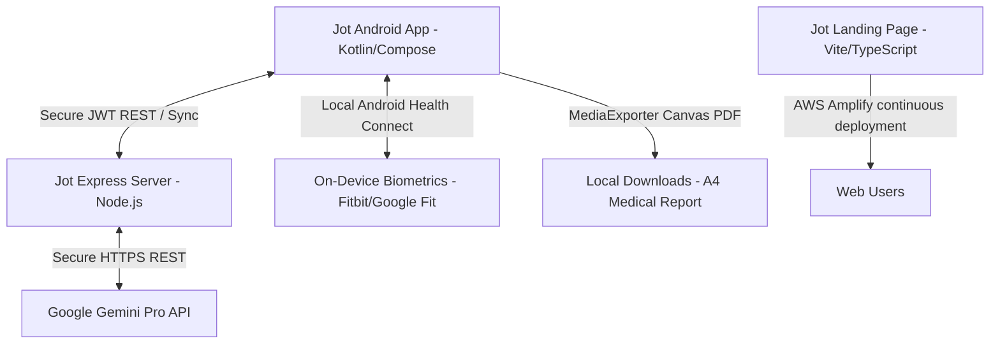

# Jot (Notel) App — Comprehensive System Architecture & Product Blueprint

Welcome to the comprehensive blueprint, product vision, and reference manual for **Jot** (under development in the `Notel` codebase). This document serves as a full-context prompt and knowledge base for AI models, developers, and auditors. It outlines the complete technical stack, target user profiles, screen-by-screen catalog, database schemas, complex wellness algorithms, and bespoke AI orchestration protocols.

---

## 1. Product Vision: What is Jot Used For?

Jot is a high-performance wellness journal, wearable data aggregator, and clinical correlation hub. Unlike generic diary or step-tracking applications, Jot is designed to link daily natural-language logging with objective physical metrics (HRV, heart rate spikes, active calories, sleep duration, and local weather patterns) to help users manage complex lives. 

### Core Target User Personas & Use Cases

#### 1. Chronic Illness & Complex Symptom Trackers (e.g., POTS, ME/CFS, MCAS, EDS)
Users suffering from dysautonomia or chronic autoimmune conditions use Jot to pinpoint symptom triggers, track flares, and manage day-to-day energy reserves:
*   **Orthostatic Intolerance & POTS:** Users track heart rate spikes during simple daily activities, correlating high HR events with orthostatic logs, hydration levels, and salt intake.
*   **Post-Exertional Malaise (PEM) & ME/CFS:** Chronic Fatigue Syndrome patients track their "Body Load" and energy envelopes to prevent crash cycles, monitoring sleep debt and HRV to determine if they are inside their safe operational threshold.
*   **Histamine & Mast Cell Activation (MCAS):** Users log dietary details in the food categories, cross-referencing flares, brain fog, and skin issues against environmental pressures like temperature and humidity.
*   **Zero-Friction Voice Logging:** When a user is in the middle of a symptom flare or experiencing severe brain fog, opening the app and typing is difficult. They use the **Voice AI Assistant** to record hands-free: *"um, feel really lightheaded, my chest is tight and my heart is racing real bad right now after standing up."* The AI cleans up the fillers and records the symptoms immediately in the correct categories without user strain.

#### 2. Endurance Athletes & Hybrid Runners
Performance-driven users utilize Jot to optimize their training intensities and avoid injuries or systemic over-training:
*   **Training Strain & Load Balance:** Marathon and hybrid athletes monitor their active calorie Acute-to-Chronic Workload Ratio (ACWR) to make sure they do not ramp up weekly mileage too quickly, which leads to injury.
*   **Recovery Monitoring:** Track sleep quality trends, HRV baselines, and resting heart rates alongside physical soreness logs to determine when to schedule active recovery days.
*   **Variable Testing:** When starting a new recovery supplement, training shoes, or pre-workout routine, athletes use Jot to monitor its impact over a strict evaluation period.

#### 3. Medical Alignment & Doctor Engagement
Patients who struggle to convey their longitudinal health history to specialists use Jot to bridge the communication gap:
*   **Objective Longitudinal Summaries:** Doctors rarely have time to read through hundreds of daily journal logs. Users generate a clean, professional **Clinical Longitudinal Report** (PDF) summarizing trends, trigger mapping, and major biometric outliers.
*   **Strategic Doctor Inquiry:** The final section of the PDF dynamically generates highly specific questions to ask their specialist, backing up claims with objective data points (e.g., *"My average active sleep duration dropped by 1 hour and 15 minutes, coinciding with a 23% spike in sedentary heart rate anomalies"*).

#### 4. Habit Tracking & Interactive Wellness Accountability
Users seeking to build permanent routines use Jot as an active accountability companion:
*   **Interactive AI Coaching:** The conversational coach ("Jot Coach") acts as a warm, supportive partner, automatically suggesting local habits, creating dynamic checklists, and setting medication or hydration reminders based on daily conversations.

---

## 2. Ecosystem & System Architecture

The Jot ecosystem comprises three primary components: an Android Native Client, an Express.js Backend API, and a static Vite Marketing Website.



### Flow of Operations:
1. **Biometric Collection:** On-device wellness data (Sleep, HRV, active calories, resting heart rate spikes) is polled from **Android Health Connect** and synchronized via **Fitbit OAuth2** directly into local preferences and Room.
2. **Text Logging:** Users submit voice notes or text logs. The voice assistant provides real-time on-device speech-to-text with two modes: **Save Raw** (instant local Room write) or **Clean with AI** (server-side Gemini cleanup & category classification).
3. **Conversational Coaching:** Users chat with **Jot Coach** on a custom session-based HTTPS bridge. The server enriches the LLM prompt with local logs, active event counters, Fitbit statistics, and weather history. It parses custom tags returned by the LLM (`[PROPOSE_LIST]`, `[PROPOSE_NOTE]`, `[PROPOSE_REMINDER]`, `[PROPOSE_FILE]`) to generate interactive on-screen action cards.
4. **Longitudinal Clinical Exporter:** The local app requests a deep statistical summary from the server, passes it to the `ReportGenerator` class, which manually draws an A4-sized PDF using raw Android `Canvas` coordinates, supporting structured tags `[SECTION]`, `[BOLD]`, and `[BULLET]` for offline medical validation.

---

## 3. Client-Side Architecture (Android Native App)

The Android application (`Notel`) is built as a state-of-the-art native client utilizing modern Google Jetpack guidelines.

*   **Language:** Kotlin (1.9.x+)
*   **UI Framework:** Jetpack Compose (Declarative, component-based, custom typography, glassmorphism designs)
*   **Dependency Injection:** Dagger Hilt (with constructor injection, `@Singleton` services, and `@ApplicationContext` bindings)
*   **Local Storage:** Room Database (version 18, utilizing multi-phase migrations, DAOs, and Coroutine `Flow` streams)
*   **Networking:** Retrofit2 with OkHttp3 logging interceptors, automatic JWT auth injection headers, and deserialization using Kotlinx Serialization.
*   **Background Jobs:** WorkManager (configured to run periodic sync jobs, Fitbit checks, and Health Connect fetches while conserving battery)
*   **Speech Recognition:** Native on-device Android `SpeechRecognizer` using a lifecycle-aware `RecognitionListener` inside Compose screens.

### Project Structure (under `app/src/main/java/com/notel/notel`):
*   `MainActivity.kt` & `NotelApp.kt` — Core entry points and Hilt Application setup.
*   `VoiceLogActivity.kt` & `VoiceLogWidget.kt` — Hands-free logging screens and app widgets.
*   `data/` — Models, Local Database, remote API services, Health Connect handlers, repositories, and preferences.
*   `di/` — Dagger Hilt dependency modules (Database Module, Network Module).
*   `ui/` — Screens (27 distinct screens, including sleep, habits, reminders, trends, Fitbit, food, community, profile setup, and coaching) and ViewModels.
*   `util/` — PDF exporters, notification helpers, and lifecycle trackers.

---

## 4. UI Screen Catalog

The application features 27 distinct screens built with modular Jetpack Compose components:

| Screen Name | Layout / File | Key Feature / Business Logic |
| :--- | :--- | :--- |
| **Quick Log Screen** | `QuickLogScreen.kt` | The central entry point for rapid journaling, featuring Category selection tiles, manual typing fields, and real-time AI suggestion chips. |
| **Voice Log Screen** | `VoiceLogActivity.kt` | Voice logging overlay that uses the device's native mic to transcribe audio, with options to "Save Raw" or "Clean with AI". |
| **Body Load Screen** | `BodyLoadScreen.kt` | Interactive strain panel showing the calculated Body Load score out of 100, Sleep Debt balances, ACWR, and sedentary heart rate spikes. |
| **Coach Screen** | `CoachScreen.kt` | An active conversation viewport with **Jot Coach**, rendering bubble chats and converting dynamic tag outputs into custom action cards. |
| **Coach History Screen** | `CoachHistoryScreen.kt` | A catalog of saved session threads with titles generated automatically by AI based on the first user message. |
| **Key Metrics Screen** | `KeyMetricsScreen.kt` | High-level dashboard aggregating Fitbit and Health Connect metrics (Average HR, Active Calories, HRV, Sleep Duration) for rapid check-ins. |
| **Sleep Screen** | `SleepScreen.kt` | In-depth sleep analysis rendering hypnograms, resting heart rate dips, sleep efficiency ratios, and target-deficit tracking. |
| **Fitbit Screen** | `FitbitScreen.kt` | OAuth2 connection interface enabling users to authenticate and authorize Fitbit synchronization. |
| **Food Screen** | `FoodScreen.kt` | Diet tracker focused on food logging, trigger checks, meals, and histamine levels. |
| **Habits Screen** | `HabitsScreen.kt` | Habit logging page displaying daily checklists, current streaks, and historical completion statistics. |
| **Reminders Screen** | `RemindersScreen.kt` | Setup panel for scheduled notifications, supporting exact hour triggers or interval schedules. |
| **Trends Screen** | `TrendsScreen.kt` | Historical data plots, charts, and AI-driven correlation analyses between categories (e.g. sleep quality vs fatigue). |
| **Lists Screen** | `ListsScreen.kt` | Dynamic checklist dashboard for managing permanent custom checklists. |
| **Data Connections Screen** | `DataConnectionsScreen.kt`| Health Connect API permissions portal enabling toggling of heart rate, sleep, active energy, and HRV parameters. |
| **Settings Screen** | `SettingsScreen.kt` | Management dashboard for user profiles, demographics, premium memberships, and local database management. |

---

## 5. Server-Side Architecture (Node.js / Express Backend)

The Jot Server (`jot-server`) is a production-ready, secure Express API designed to act as an authentication gate, synchronization database, and AI gateway.

*   **Runtime:** Node.js (v18+)
*   **Framework:** Express.js
*   **Security & Hardening:**
    *   `helmet`: Injects critical HTTP security headers.
    *   `cors`: Locks requests down to authorized domains.
    *   `express-rate-limit`: Prevents DDoS and API abuse with route-specific window policies:
        *   **AI Routes:** Capped at 30 requests per minute per IP.
        *   **Auth Routes:** Capped at 10 requests per 15 minutes to prevent brute-force attacks.
    *   **JWT Middleware:** Standard token-based request authorization using custom middleware (`requireAuth`).
*   **AI Interface:** Calls the Google Gemini REST API directly using `node-fetch`. It uses a custom **thinkingConfig bypass** (`thinkingBudget: 0`) to prevent thinking models (e.g. Gemini 2.0/2.5 Thinking) from embedding raw reasoning lines in the primary content stream, ensuring strict JSON array parsability.

### Server Routing Directory (`jot-server/src/routes/`):
*   `auth.js` — Handles user signups, credentials hashing, JWT generation, and password resets.
*   `sync.js` — Coordinates bidirectional sync for log entries, categories, event counters, and preferences.
*   `ai.js` — Houses high-complexity prompts, LLM fallback retry loops, and JSON schema extraction tools.
*   `billing.js` — Verifies app memberships, subscriptions, and unlocks unlimited features.
*   `friends.js` & `habits.js` — Coordinates community features, sharing requests, and habit tracking completion logs.

---

## 6. Landing Page & Web App (Static Vite Frontend)

The website directory contains the marketing and user onboarding web application built for lightning-fast speeds and high-conversion aesthetic appeal.

*   **Bundler & Core Tooling:** Vite, HTML5 semantic layout, TypeScript
*   **Styling (Vanilla CSS):** Tailored HSL color models, custom media breakpoints, sleek dark-mode glassmorphic cards, smooth micro-interactions.
*   **Integrations:** Chart.js integration displaying user summaries in an interactive, responsive pie chart with custom HTML legends.
*   **Continuous Deployment:** Pre-configured with `amplify.yml` for zero-downtime AWS Amplify continuous hosting directly from GitHub commits, resolving base directories, custom redirects, and auto-provisioning SSL/HTTPS certificates.

---

## 7. Database Schemas & Data Models (Room Database)

The database is built on Android Room with 8 distinct database tables.

### 1. `Category` (`categories` table)
Stores the logging domains available to users (e.g. Symptoms, Diet, Medication).
*   `id`: `Int` (Primary Key, AutoIncrement)
*   `name`: `String` (e.g., "Sleep", "Food", "Medication", "Symptoms")
*   `icon`: `String` (Material Icon name string)
*   `colorHex`: `String` (RGB color code for UI rendering)
*   `isDefault`: `Boolean` (System category flag)
*   `sortOrder`: `Int` (Ordering priority)

### 2. `LogEntry` (`log_entries` table)
Stores the actual user journal/logs.
*   `id`: `String` (UUID Primary Key)
*   `categoryId`: `Int` (Foreign Key mapping to Category)
*   `body`: `String` (Primary clean text describing the state)
*   `chips`: `String` (Comma-separated Quick Note tags selected)
*   `manualText`: `String` (Optional original uncleaned text - deprecated to reduce redundancy)
*   `timestamp`: `Long` (Epoch milliseconds)
*   `source`: `String` (e.g., "Text", "Voice Raw", "Voice AI", "Coach Approved")
*   `isSynced`: `Boolean` (Sync status flag)

### 3. `Reminder` (`reminders` table)
Manages goal notifications and medication scheduling.
*   `id`: `Int` (Primary Key, AutoIncrement)
*   `title`: `String` (Reminder name)
*   `type`: `String` (e.g., "FIXED" at specific hours, "INTERVAL" repeating every X hours)
*   `fixedHour`, `fixedMinute`: `Int` (Schedule coordinates)
*   `intervalHours`, `intervalMinutes`: `Int` (Frequency of repeating alarms)
*   `startHour`, `startMinute`, `endHour`, `endMinute`: `Int` (Active alarm window constraints)
*   `isEnabled`: `Int` (Toggle active state)

### 4. `KnowledgeDocument` (`knowledge_documents` table)
Caches uploaded PDFs and doctor notes locally for offline correlation.
*   `id`: `String` (UUID Primary Key)
*   `name`: `String` (Original file name)
*   `mimeType`: `String` (e.g., "application/pdf", "text/plain")
*   `filePath`: `String` (Absolute local disk file path)
*   `extractedText`: `String?` (Full plain text extracted via Gemini for low-latency prompt integration)

### 5. `CoachSession` & `CoachMessageEntity`
Manages local history of conversations with the AI Coach.
*   `CoachSession`: `id` (UUID PK), `title`, `createdAt`, `updatedAt`, `isSynced`
*   `CoachMessageEntity`: `id` (UUID PK), `sessionId` (FK), `role` ("user" | "model"), `content`, `timestamp`, `isSynced`

### 6. `UserList` & `UserListItem`
Supports permanent custom interactive checklists created by the user or proposed by the coach.
*   `UserList`: `id` (AutoIncrement PK), `name`, `createdAt`
*   `UserListItem`: `id` (AutoIncrement PK), `listId` (FK), `text`, `sortOrder`

---

## 8. Biometric Engines & Complex Calculations

The app includes highly specialized statistical engines to quantify and correlation-map physical strains.

### 1. Daily Stress & Strain ("Body Load" Score)
Calculated dynamically out of 100 on the active day using three distinct vectors:
$$Body\ Load = (Heart\ Rate\ Spike\ Factor) + (ACWR\ Factor) + (Sleep\ Debt\ Factor)$$

*   **Heart Rate Spike Factor (33.3% weight):**
    Aggregates extreme heart rate elevations detected by Health Connect during inactive intervals (sedentary spikes over standard deviation bounds).
*   **Active Calorie ACWR Factor (33.3% weight):**
    Calculates the Acute-to-Chronic Workload Ratio (ACWR) for active energy expenditure:
    $$ACWR = \frac{\text{Acute Workload (Past 7-day average calories)}}{\text{Chronic Workload (Past 28-day average calories)}}$$
    An ACWR value outside the "sweet spot" ($0.8 - 1.3$) scales up the Body Load strain score, penalizing both over-training (danger zone $> 1.5$) and sudden under-training.
*   **Sleep Debt Factor (33.3% weight):**
    Derived from a rolling 10-day sleep deficit algorithm.

### 2. Rolling Sleep Debt Algorithm
Tracks deficit trends relative to an 8-hour target ($T = 480\text{ minutes}$):
1. Polled from Health Connect sleep records over a rolling 10-day window:
2. For each day:
    $$\Delta = \text{Actual Sleep Hours} - 8.0$$
    *   If $\Delta < 0$, it is added to the active debt:
        $$\text{Debt}_{\text{new}} = \text{Debt}_{\text{old}} + |\Delta|$$
    *   If $\Delta \ge 0$, the surplus is applied to reduce the debt, but it is capped at a maximum recovery rate of 1.5 hours per night:
        $$\text{Debt}_{\text{new}} = \text{Debt}_{\text{old}} - \min(\Delta, 1.5)$$
    *   The accumulated debt balance is strictly bound by 0 (cannot have negative debt):
        $$\text{Debt} = \max(0.0, \text{Debt})$$
3. In the UI, this balance is negated so that negative numbers cleanly display an active sleep deficit (e.g. `-4.5 hours sleep debt`).

---

## 9. Advanced AI Features & Integration Specs

Jot integrates Google Gemini 2.5 and 3.5 models.

### 1. Real-Time Dynamic Suggestion Chips
Generates 6-10 highly relevant, single-touch contextual suggestion tiles for logging.
*   **Rules & Constraints:**
    *   **Max Character Length:** Strictly 20 characters or less per chip (including spaces).
    *   **Length Constraint:** 1–3 words total.
    *   **Content Policy:** Mix symptom descriptions, severity labels (e.g., "7/10 severity"), and locations.
    *   **Filler Ban:** Absolutely no generic adverbs, prepositions, or time-references as standalone elements ("very", "just", "often").
    *   **No Parentheses:** Standard symbols like `()` are banned. Use plain text descriptions ("left side" instead of "(left)").
    *   **No Questions:** Punctuation like `?` is banned.

### 2. On-Device Voice Log AI Cleanup
Cleans and structures transcribed voice logs using a specialized server endpoint `/api/ai/classify-coach-note`.
*   Processes natural-language audio transcripts (e.g. "uh let's see so my stomach hurts real bad and I think it's from the lunch").
*   Strips filler words ("um", "uh", "like") and corrects grammatical errors without changing key clinical metrics.
*   Automatically classifies the log into the single best user Category ID (falling back to General ID 7 if the confidence interval is low) and writes directly to Room.

---

## 10. AI Coach Protocol (Jot Coach Tag Engine)

"Jot Coach" is an interactive, warm, and highly clinical AI health companion. In addition to answering user prompts, it operates as an on-device orchestrator by appending **special bracketed action tags** to its final response block.

```
[SYSTEM INSTRUCTION: Only output at most ONE action tag per conversational turn. Prioritize PROPOSE_LIST above all others.]
```

### The Tag Catalog:
1.  **Note Saving Tag:**
    Used when the user shares new symptoms, moods, or events that would be valuable to persist in their history.
    *   **Format:** `[PROPOSE_NOTE: <note draft text in first person>]`
    *   **Constraint:** Must be written strictly in the **first person** (e.g. "Took 200mg Advil for my migraine" rather than "Patient took Advil").
2.  **File Upload Tag:**
    Used when the user shares a PDF or health file. The server parses the file contents, and the coach asks to save it to their permanent knowledge base.
    *   **Format:** `[PROPOSE_FILE: <exact_filename.pdf>]`
3.  **Custom List Proposing Tag (Highest Priority):**
    Triggered when the Coach generates recipes, checklists, training routines, guidelines, or checklists. It generates a permanent checkable UI list.
    *   **Format:** `[PROPOSE_LIST: List Name|Item 1|Item 2|Item 3|...]`
    *   **Example:** `[PROPOSE_LIST: Morning Protocol|Salt Water Hydration|15 Mins Sunlight|Mobility Routine]`
4.  **Reminder Proposing Tag:**
    Triggered when establishing daily routines or supplement schedules.
    *   **Format:** `[PROPOSE_REMINDER: Reminder Title|HH:MM]`
    *   **Time Constraint:** Uses 24-hour HH:MM format.

The Android app intercepts these tags on receipt, strips them from the conversational text block, and uses them to render interactive, beautiful UI cards (e.g., "Tap to Save Note", "Create Morning Protocol List").

---

## 11. Longitudinal Medical Exporter (PDF Drawing Engine)

The app compiles complex user logs and biometric streams into an official, professional **Clinical Longitudinal Report** that users can print and present to a physician.

### 1. Data Ingestion Stream
*   Pulls up to **300 recent log entries** to establish a long-term chronological trend.
*   Enriches the prompt with user demographics (Age, Gender, Height, Weight), weather metrics, active event counters, and rolling Fitbit/Health Connect trends.
*   Applies a **Priority Overrides System:**
    *   **Professional/Doctor Notes** have the absolute highest priority.
    *   If conflicts arise, the **most recently dated entry** always wins.

### 2. Structured Custom Markup Parsing
The Gemini service outputs a text summary structured with specific XML-style tag headers:
*   `[SECTION] <Header>` for primary sections. Section lines must not contain bold formatting.
*   `[BOLD] <text> [BOLD]` for text emphasis (converted from traditional Markdown `**` tags).
*   `[BULLET] <point>` for bullet lists.

### 3. Native A4 Canvas Coordinate Renderer
Rather than relying on HTML-to-PDF rendering packages, `ReportGenerator.kt` instantiates an A4 native Android `PdfDocument` page ($595 \times 842$ coordinates) and manually draws all elements onto a `Canvas` with high-precision measurements.

```kotlin
// Drawing coordinates flow:
val pageInfo = PdfDocument.PageInfo.Builder(595, 842, 1).create()
var page = pdfDocument.startPage(pageInfo)
var canvas = page.canvas
var y = 60f
val margin = 50f
val contentWidth = 495f
```

*   **Line-Wrapping & Text Breaks:**
    Includes a bespoke string wrapping system (`wrapText`) that measures pixel widths using a `Paint` object (`paint.measureText`). If a word exceeds the margins, it recursively wraps to the next line. If a single word is wider than the margins, it breaks it character-by-character to prevent page overflows.
*   **Page Boundary Control:**
    Tracks the active vertical coordinate `y`. If `y > 780`, the renderer automatically finishes the current page, creates a new blank page, sets the canvas coordinates back to `y = 60f`, and resumes drawing.
*   **Styled Text Rendering:**
    Parses `[BOLD]` and `[ITALIC]` tags dynamically inline by drawing substring segments side-by-side on the same baseline, shifting the active `x` coordinate using `paint.measureText` for each segment.

---

## 12. Development, Testing & Deployment Workflows

Use the following standard procedures to build, test, and deploy modules within this repository.

### 1. Running the Android Application Locally
1.  Open `/Users/Tysonn/AndroidStudioProjects/Notel` inside Android Studio.
2.  Ensure local developer properties (`local.properties`) point to your active SDK paths.
3.  Compile and build the app using your Gradle wrapper:
    ```bash
    ./gradlew assembleDebug
    ```
4.  Run unit tests to verify Room migration stability:
    ```bash
    ./gradlew test
    ```

### 2. Launching and Testing the Express Backend
1.  Navigate to the `jot-server` directory:
    ```bash
    cd jot-server
    ```
2.  Install all node modules cleanly:
    ```bash
    npm ci
    ```
3.  Configure your environment secrets by creating a `.env` file from the template:
    ```bash
    cp .env.example .env
    # Populate GEMINI_API_KEY and other parameters
    ```
4.  Run the local server in development mode:
    ```bash
    npm run dev
    ```
    *The API will listen at `http://localhost:3000` with the health check live at `/health`.*

### 3. Deploying the Website Landing Page to AWS Amplify
1.  Log in to the **AWS Amplify Console**.
2.  Connect your repository (e.g. `TScadden/jot-app`) and branch.
3.  Set the Amplify Build Settings to match these parameters:
    *   **Base Directory:** `website`
    *   **Build Command:** `npm ci && npm run build`
    *   **Publish Directory:** `website/dist`
4.  Save and Deploy. Continuous builds will automatically trigger on every git push to the main branch.

---

*This blueprint serves as the official source-of-truth for the entire Jot (Notel) application ecosystem.*
